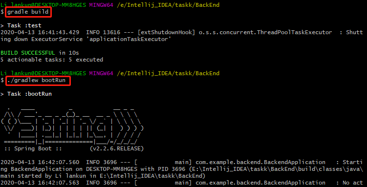

# 运行后端代码

1. 修改BackEnd\src\main\resources目录下的Tasks.json的文件位置

```
todo.store.filename = <你的目录下Tasks.json的绝对路径>
```

2. 命令行打开输入：gradle build
3. 命令行输入：./gradlew bootRun



4. 接口说明

|  方法  |      接口      |           说明           |             接口示例              |
| :----: | :------------: | :----------------------: | :-------------------------------: |
|  GET   |   api/tasks    |     获取当前任务列表     |  http://localhost:8080/api/tasks  |
|  GET   | api/tasks/{id} |      按编号查询任务      | http://localhost:8080/api/tasks/1 |
|  POST  |   api/tasks    | 按照json格式新增一条任务 |  http://localhost:8080/api/tasks  |
|  PUT   | api/tasks/{id} |  按照任务id更新一条任务  | http://localhost:8080/api/tasks/1 |
| DELETE | api/tasks/{id} |    按照id删除一条任务    | http://localhost:8080/api/tasks/1 |

