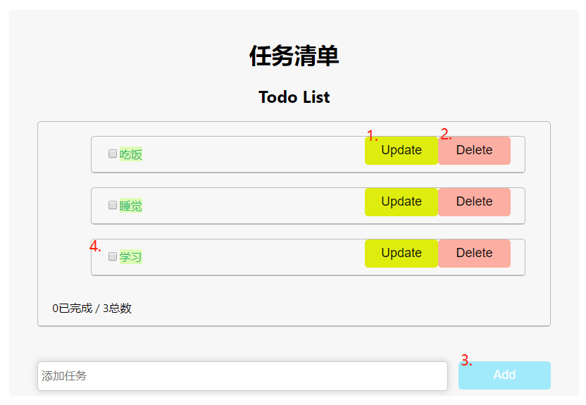

## 前端运行

`npm install`

`npm start`

##  前端list展示



1. 编辑任务
2. 删除任务
3. 添加任务
4. 标记任务是否已经完成

## Ajax实现：axios

1. componentDidMount方法

```js
    componentDidMount() {
        axios.get('http://127.0.0.1:8080/api/tasks')
          .then(res => this.setState({ todoList: res.data }));
    }
```

> 该方法在render()之后执行，get返回所有待办任务的json格式

2. 添加任务

```js
  addNewItem = (inputValue) => {
    axios.post('http://localhost:8080/api/tasks', {
      id: _.parseInt(this.state.todoList.length ?         this.state.todoList[this.state.todoList.length - 1].id : 0) + 1,
      content: inputValue
    }).then(res => this.setState({
        todoList: [...this.state.todoList, res.data]
    }));
  }
```

> post方法添加id和content属性发起请求

3. 删除任务

```js
deleteItem1= (id) => {
     axios.delete(`http://localhost:8080/api/tasks/${id}`)
     .then(res => this.setState({ todoList: res.data }));
  }
```

> delete方法传入参数id进行删除

4. 编辑任务

```js
  updateItem1 = (id) => {
     console.log(id);
     var inputValue = window.prompt('请输入修改内容');
     axios.put(`http://localhost:8080/api/tasks/${id}`, {
       id:id,
       content: inputValue
      }).then(res => this.setState({
       todoList: res.data
      }));
  }
```

> put方法传入id和content参数对任务进行编辑