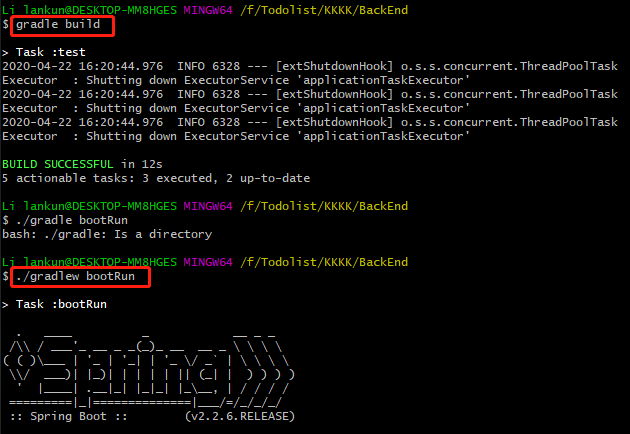
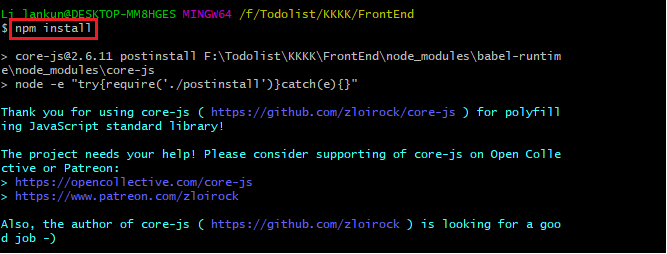
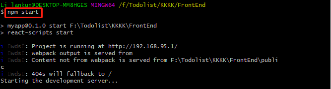
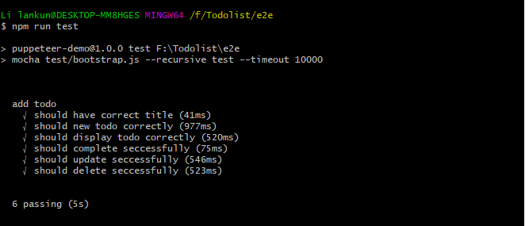

## TodoList 多人协作开发

#### 运行本项目

> 1. 启动后端BackEnd：
>
> * 修改application.properties中Task.json文件位置为当前自己的路径。注意不要在Task.json内再添加条目，以使得build(test)通过。
> * 命令行执行：gradle build
> * 命令行执行：./gradlew bootRun

> 2. 启动前端FrontEnd：
>
> * npm install
> * npm start

> 3. 运行e2e：
>
> * npm install
> * npm run test

> 说明：为保证测试的正常进行，在每个端到端的测试函数中均加入了延迟函数(await page.waitFor( );)，故每个测试的时间会有相应的时长。