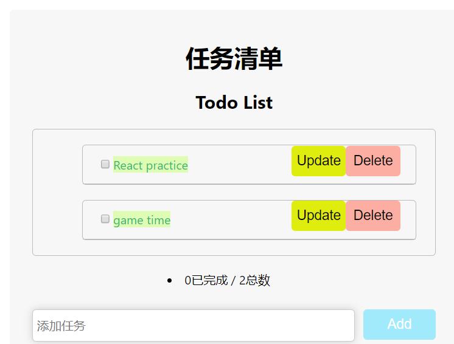
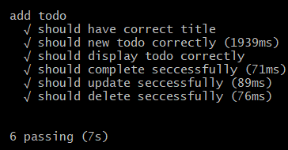

## e2e-demo运行

`npm install`

`npm run test`

## 完成TodoList自动化测试

> 1. 测试添加新的待办事项
> 2. 测试渲染所有待办事项（判断待办事项的长度即可）
> 3. 测试完成待办事项
> 4. 测试更新待办事项
> 5. 测试删除待办事项

### 代码和相关截图

1. 测试添加新的待办事项

```js
it('should new todo correctly', async function() {
   //点击输入框
   await page.click('#new-todo', { delay: 500 });
   //输入内容
   await page.type('#new-todo', 'new todo item', {delay: 50});
   //点击add   
   //await page.keyboard.press("Enter");
   await page.click('#add-new-todo', { delay: 500 });
   let todoList = await page.waitFor('#todo-list');
   const expectInputContent = await page.evaluate(todoList => todoList.lastChild.querySelector('span').textContent, todoList);
   expect(expectInputContent).to.eql('new todo item');
   //await page.waitFor(5000);
})
```

> 添加一个新事项new todo item，检查最后一项是否为’new todo item’

2. 测试渲染的正确性

```js
it('should display todo correctly', async function() {
   //默认有两个事件
   //获取todo-list ul, 其下还有两个初始ul，刚刚又新加了一个，所以现在应为3
   const list_length = await page.$$eval('#todo-list ul', e => e.length);
   //console.log(list_length - 1);
   expect(list_length).to.eql(3);
   //await page.waitFor(5000);

  }) 
```

> 首先获取整个列表的长度，默认有两个事项，新增一个事项，现在应该现存3个

3. 完成待办事项

```js
it('should complete seccessfully', async function () {
   //第'1'个事项的checkbox在 ID为todo-list下的ul下的 ul下的第'1'个孩子下的 li下的input上
   //1).点击第1个事件的完成checkbox
   await page.click('#todo-list > ul:nth-child(1) > li > input', { delay: 50 });
   //2).获取点击后的checkbox的checked的值
   const checkbox_Status1 = await page.$eval('#todo-list > ul:nth-child(1) > li > input', el => el.checked);
   const checkbox_Status2 = await page.$eval('#todo-list > ul:nth-child(2) > li > input', el => el.checked);
   //3).默认为完成，现在应该为完成了
   expect(checkbox_Status1).to.eql(true);
   //默认为未完成，依旧为未完成
   expect(checkbox_Status2).to.eql(false);
   //await page.waitFor(5000);
  }) 
```

> 定位到checkbox的selector，然后点击这个checkbox，之后通过验证两个条目的状态

4. 测试更新的正确性

```js
it('should update seccessfully', async function () {
  //1).先获取第3个(新建)事件的内容
  const thirdInputContent = await page.$eval('#todo-list > ul:nth-child(3) > li > span', el => el.textContent);
  //console.log(thirdInputContent)
  //'new todo item'
  //2)往prompt弹框中输入新内容 new new todo item
  // 设置弹框点击函数，在此处设置后，不管后续页面出现多少个弹框，都会默认点击确认。
   await page.on('dialog', async dialog => {
   await dialog.accept('new new todo item');
  });
  //3).点击第3个(新建)事件的更新按钮
  await page.click('#todo-list > ul:nth-child(3) > li > button.update-btn', { delay: 50 });
  //4)验证
  let todoList = await page.waitFor('#todo-list');
  const expectInputContent = await page.evaluate(todoList => todoList.lastChild.querySelector('span').textContent, todoList);
  expect(expectInputContent).to.eql('new new todo item');
  //await page.waitFor(5000);
 })
```

> 点击第三个项目的update按钮，输入new new todo item，检查第三个条目内容是否为new new todo item。

5. 测试删除的正确性

```js
it('should delete seccessfully', async function () {
   //1).先获取第3个(新建)事件的内容
   const thirdInputContent = await page.$eval('#todo-list > ul:nth-child(3) > li > span', el => el.textContent);
   //'new todo item'
   //2).点击第3个(新建)事件的删除按钮
   await page.click('#todo-list > ul:nth-child(3) > li > button.delete-btn', { delay: 50 });
   //3).当前长度
   const list_length = await page.$$eval('#todo-list ul', e => e.length);
   //4).获取当下所有的事件（名）
   var delete_flag = 1;
   const all_Content = await page.$$eval('#todo-list ul', ele=>{
​    var dd = {};
​    for(var i = 0; i < ele.length; i++){    
​     dd[i] = ele[i].querySelector('span').textContent;
​    }
​    return dd;    
   });
   //存于all_Content中
   //console.log(all_Content);
   //5).遍历, 如果发现'new new todo item',置0
   for (var i = 0; i < list_length; i++){
​    if (all_Content[i] === thirdInputContent) {
​     delete_flag = 0;
​     break;
​    }
   }
   //console.log(delete_flag);
   expect(delete_flag).to.eql(1);
   //await page.waitFor(5000);
})
```

> 先取得第三个项目的内容，new new todo item，点第三个项目的删除按钮，然后在所有项目中查询是否还存在new new todo item

6. 最终截图



